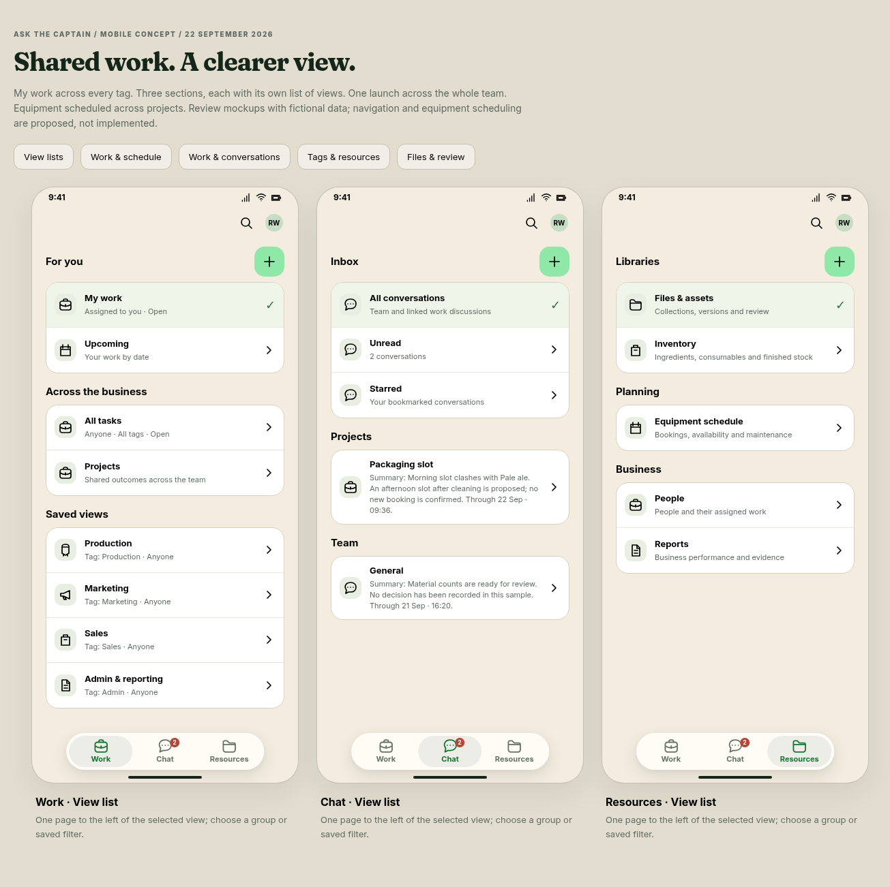
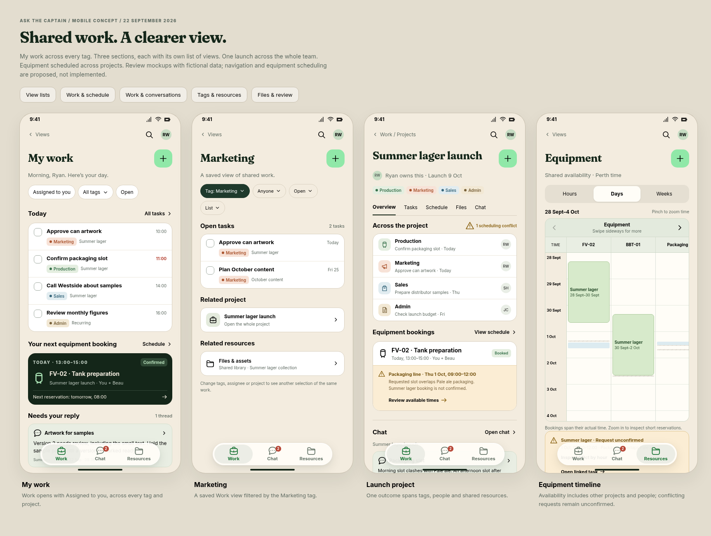
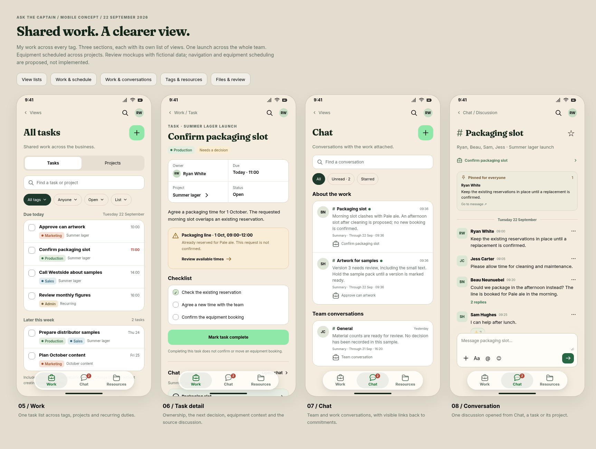
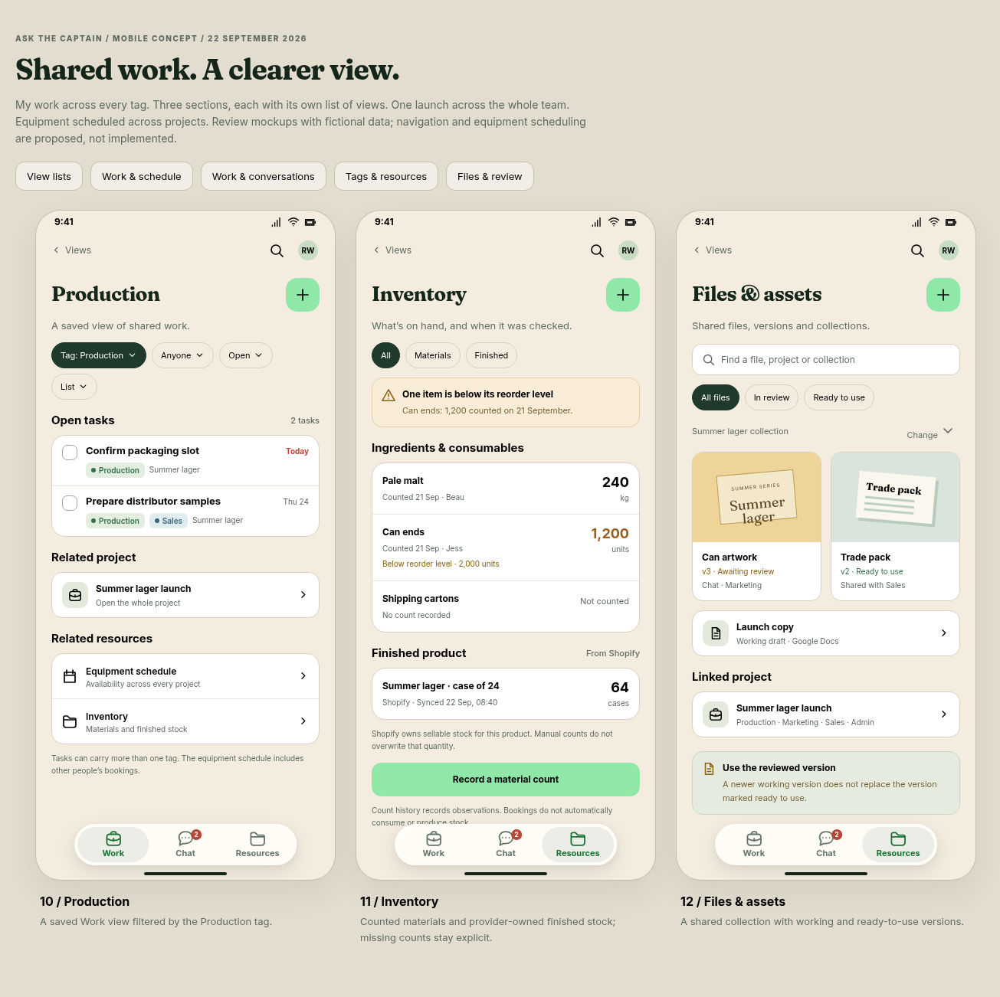
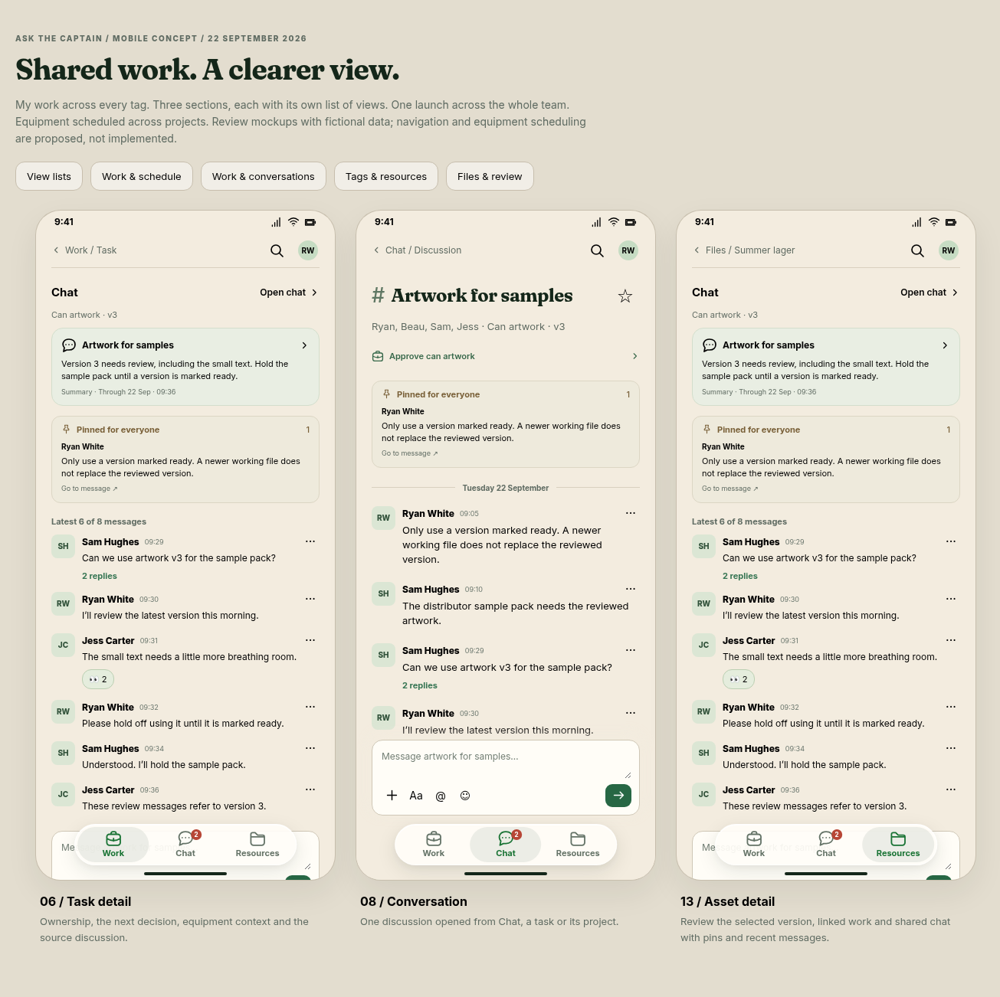
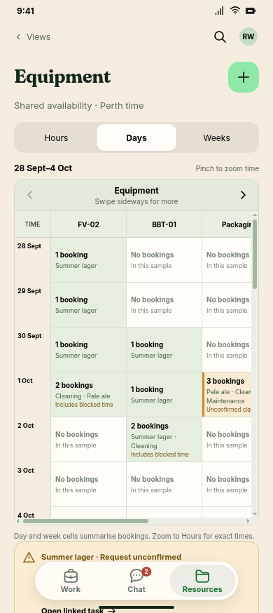

# Captain mobile workspace mockups

**Review concept, updated 23 September 2026.** Fifteen screens for the Captain/Pip split,
advancing **own commitments** and **brief and answer**. All data is fictional; the reference day
remains 22 September. These are documentation artifacts, not implemented application routes.

## Three sections and their view lists

The bottom bar is **Work · Chat · Resources**. Work opens at **My work**, filtered to **Assigned
to you**, across all tags. There is no Home destination. Each section has a grouped list of
views one page to the left of its main page, opened by the header's back chevron. These pages
need no visible title: their groups, rows and selected bottom tab carry context. They have
accessible headings. Choose a row to open a view to the right.



| Section | Groups | Main view in this concept |
|---|---|---|
| Work | For you; Across the business; Saved views | My work, assigned to you. All tasks removes the assignee filter; Marketing and Production are tag-filtered views. |
| Chat | Inbox; Projects; Team | All conversations. Task/project links open the same discussion. |
| Resources | Libraries; Planning; Business | Files & assets. Inventory and Equipment schedule are sibling views; People and Reports remain to design. |

The intended native client preserves each tab's view and scroll position, supports the normal
back gesture and returns details to the originating view. This static prototype demonstrates
explicit navigation links; tab switches reopen their defaults, detail breadcrumbs use fixed
parent examples, and native transitions/state restoration are not implemented.

Production, Marketing, Sales and Admin/reporting are **tags**, not areas or workspaces. Tasks
can carry multiple tags; people and projects span them. Filter controls cover assignee, tags,
project, status and date. Different filter types combine with AND; multiple selected tags match
any selected tag by default. Active filters remain visible. Presentation choices (List, Board,
Calendar, Timeline) do not create separate task records. Arbitrary combinations, saving filters
and the other presentation layouts remain to implement.

[View map and shared-record relationships](views.md) show the navigation and shared identities.

## Screen previews



| Screen | Preview | Scope |
|---|---|---|
| My work | [Default Work view](work.png) | Assigned to you across tags, today's work, next equipment booking and a linked conversation. |
| Marketing | [Saved tag view](marketing.png) | Anyone · Tag: Marketing · Open; links to the whole project and shared files. |
| Project | [Summer lager launch](project.png) | Tasks across tags, shared bookings and discussion. |
| Equipment | [Timeline](timeline.png) | Reservations across projects, cleaning/maintenance and a conflicting request kept unconfirmed. |



| Screen | Preview | Scope |
|---|---|---|
| All tasks | [Task list](all-work.png) | Anyone · All tags · Open, across projects and recurring work. |
| Task | [Packaging](task.png) · [Artwork](task-artwork.png) | Owner, next decision, supporting record and discussion. Completion does not implicitly confirm equipment or approve a file. |
| Chat | [Conversation list](chat.png) | Team and work discussions with task links. |
| Conversation | [Packaging discussion](conversation.png) | One thread shared by Chat, task and project contexts. |



| Screen | Preview | Scope |
|---|---|---|
| Production | [Saved tag view](production.png) | Anyone · Tag: Production · Open, including a task also tagged Sales. Related equipment and stock links. |
| Inventory | [Counted stock](inventory.png) | Material observations, missing count, reorder threshold and separately sourced Shopify stock. |
| Files & assets | [Shared collection](files.png) | Working and ready-to-use versions in one shared library. |
| Asset | [Can artwork v3](asset.png) · [Trade pack v2](asset-trade.png) | Version-specific chat with shared pins and recent messages; provider-held original. |
| View lists | [Work](work-views.png) · [Chat](chat-views.png) · [Resources](resource-views.png) | Grouped navigation with no visible page title. |

[Files and review gallery](files-overview.png) · [Lower content of the first four screens](overview-scrolled.png).

## Visual direction

The supplied Taildrop tab-bar example informs the floating capsule, rounded corners, subtle
shadow and selected pill around both icon and label. The compact bar is about 80% of the
previous width and height (about 290 × 54px on a 390px phone), with most of the reduction
coming from spacing. Icons are 22px and labels remain 11px. The selected pill uses a darker
grey-green at 50% opacity over the bar: exactly halfway between the previous highlight
and the visible bar background, keeping the green icon and text. The three rounded icons are a
briefcase, conversation bubble and folder, freshly authored for the prototype. Labels stay
visible and each tab target exceeds 44 CSS pixels. Scroll content reserves bottom space so
its final controls can clear the floating bar.

Captain's forest/paper/mint colours and Fraunces/Inter type come from `packages/ui/design`;
no design mirror files change. Compact headers contain a breadcrumb, search and avatar, with
no logo/wordmark. Screen headings are 26px, or 25px for the project at narrow widths. Search
and account/settings remain header controls, outside the three-tab navigation.

## Contextual creation, summaries and stars

The green plus opens the current view's primary editor: **New task** in Work, **New conversation**
in Chat, **Link file** in Files, **Record count** in Inventory and **Reserve equipment** on the
timeline. My work suggests you as owner; a saved tag view suggests its tag. Defaults remain
editable; these previews describe the editor and do not write data. The full mapping and save
behaviour are specified in the main proposal. The plus also appears on project detail (new task)
and all three grouped view lists (contextual choices for Work/Resources, new conversation for
Chat). Individual tasks, files and conversations have no green creation plus; their specific
actions and composer remain. Settings, read-only reports and other pages without a meaningful
creation action are further proposed exceptions.

Conversation links show a shared summary of decisions, unresolved questions and next actions,
with a source cut-off time. This is illustrated in My work, project, task, Chat and its grouped
view list. Summaries open the same discussion and are hand-authored fixtures, not live model
output. The proposal requires source references, access checks and honest stale/unavailable
states before implementation.

**Starred** replaces Following. Participation means following by default; a star is your own
bookmark, independent of membership or notifications. The Star conversation action is a preview;
it does not persist preferences.

## Shared item chat and the conversation layout



[Full artwork conversation](conversation-artwork.png) · [File chat](asset-chat.png) ·
[Task chat](task-chat.png) · [Project chat](project-chat.png) · [Trade-pack conversation](conversation-trade.png)

The Slack App Store screenshot supplied for this review informs the single left-aligned message
stream, compact avatars, names/timestamps, reaction chips, reply links and composer. Captain's
palette and three-tab navigation remain. Both own and other messages use the same layout.

The old file **comments** section is replaced by **Chat**. Tasks, projects and files show the
conversation summary, **Pinned for everyone**, then the latest six messages (or all messages
when fewer than six exist). Open chat leads to the same history. Pins are additional to the
six-message window: the example pin is older than the six recent messages and remains included.
They link to original messages; full and inline chat render a single shared fixture by ID.

Pins are shared with everyone who can access that chat, while starred conversations remain
personal bookmarks. Pin/unpin actions require chat-write permission and auditing in the intended
application. Deletion, edits and access changes must update pins rather than leave leaked or
stale copies. The persistent pin section is part of the scrolling page, not an overlay.

Artwork v3 chat is the same conversation on the artwork task, file and full-chat screens. Trade
pack v2 has its own chat and ready state. Version history remains a separate audit, not a chat
message. A message or reaction does not change review/task/booking state. The send, reaction,
pin and thread controls open honest preview notes; no messages or preferences are saved. Thread
detail and complete empty/loading/error/permission states remain to design. Composer text is
local to the current page and is not retained.

## Equipment planning and time zoom



[Hourly conflict inspection](timeline-hours.png) · [Week scale](timeline-weeks.png)

Time runs vertically; equipment runs horizontally. The default Days view spans several days.
Header arrows and a partially visible next column show that more equipment is available. The
five example resources are FV-02, BBT-01, Packaging, Cold room and Delivery van. The header and
time axis stay visible while scrolling the other dimension.

Pinch apart to zoom into Hours, pinch together to zoom out through Days to Weeks. Buttons offer
the same choices. The prototype anchors zoom to the date under the gesture midpoint (or viewport
centre for buttons), clamped to its loaded range, and preserves horizontal equipment position.
Every scale uses continuous booking bars: a multi-day reservation spans date lines as one bar,
with the same colours and hatched blocked time as Hours. Start position and length follow the
actual interval; short reservations become thin marks when zoomed out. Selecting a bar opens
its exact dates/times, and zooming in reveals the smaller labels.
The conflict link focuses Packaging on 1 October. No gesture moves or creates a reservation.

The prototype supports two-finger pinch and one-finger chart panning, horizontal arrow controls,
mouse/trackpad scrolling and keyboard focus/scrolling. Page zoom remains available outside the
chart. Native-device gesture behaviour, selection persistence, loading more dates/equipment and
live scheduling remain acceptance work. The 28-day dataset is explicitly fictional; gaps describe only that sample, not live availability. Unknown/unloaded data must
never look free in the application.

## Editable prototype

[index.html](index.html) contains the shared shell and original record layouts.
[additional-views.js](additional-views.js) and [additional-views.css](additional-views.css) contain
the record screens. [conversation-previews.js](conversation-previews.js) supplies shared summary fixtures.
[equipment-timeline.js](equipment-timeline.js) and [equipment-timeline.css](equipment-timeline.css)
contain the scrollable timeline and time zoom. [chat-interface.js](chat-interface.js) and
[chat-interface.css](chat-interface.css) provide shared message fixtures, inline/full chat and styling. [navigation.js](navigation.js) defines the grouped lists and saved tag
views; [navigation.css](navigation.css) styles the floating bar and lists.

Serve the repository root, for example with `python3 -m http.server 8769 --bind 127.0.0.1`, then
open `/docs/proposals/assets/captain-mobile-2026-09-22/index.html`. The default URL opens My work.
Use `?group=navigation`, `?group=original`, `?group=work`, `?group=resources`, `?group=files` or `?group=discussion&item=artwork&thread=artwork`
for review galleries. Single-screen URLs use `?screen=` with:

```text
work, all-work, marketing, production, project, timeline, task,
chat, conversation, inventory, files, asset,
work-views, chat-views, resource-views
```

Variant URLs use `?screen=task&item=artwork`, `?screen=asset&item=trade` and
`?screen=conversation&thread=artwork`. Old `day` and `browse` URLs redirect within the prototype
to My work and the Resources view list respectively. PNGs need no server. Existing font
stylesheets use Google Fonts; local serif/sans fallbacks apply if fonts cannot load.

Connected review paths:

- My work → Views → Marketing → shared files → Can artwork → artwork task → discussion.
- My work → filter control → All tasks → packaging task → discussion → task → equipment timeline.
- Chat → Views → All conversations → packaging discussion → linked task.
- Files → Views → Equipment schedule or Inventory; inventory opens honest count/source explanations.
- Work view list → Production → whole project or shared equipment and stock.

The filter sheet offers links to the illustrated combinations (My work, All tasks, Marketing,
Production). Other choices, project-list selection, dates, composition, counts and review actions
are explicit scope notes or preview sheets. They do not save data, contact providers or send
messages. Sales, Admin, Upcoming, People, Reports, Search, Settings, Board, work Calendar and the
full project list remain to design. Complete empty/loading/failed/disabled/permission states
are required before implementation.

Equipment availability includes other people and projects even when Work is filtered. On
1 October, Pale ale packaging occupies 09:00–12:00, cleaning blocks 12:00–13:00, the illustrative
open slot is 13:00–16:00 and maintenance starts at 16:00. Viewing availability does not confirm
or move a booking. An equipment reservation does not consume stock or imply a production
process model. Inventory remains a counted list, with no ledger or unrelated-unit totals.

## Validation

The fifteen layouts are checked in shared Chromium with Playwright at 360, 390 and 430 CSS
pixels, including overflow, three-tab labels/targets, scroll clearance, hidden list headings
and compact record headings. Timeline checks include horizontal navigation, time-scale anchoring,
conflict drill-down, continuous bar positions/durations at all three scales and phone widths,
and Chromium touch pinch in both directions; physical-device testing remains
outstanding. Contextual plus coverage/exclusions, shared pinned-message links, exact latest-six IDs,
file-version backlinks and flat message layouts are checked alongside the summary cards. Connected list/view/filter/task/chat/asset/equipment flows and
preview sheets are exercised, and PNG exports inspected. Screen PNGs are 390 × 874; variants
and galleries are captured separately. Both Mermaid maps are parsed and exported as SVG/PNG.

No application typecheck, Postgres tests or production-route checks are claimed for these
documentation-only changes. The operative plan's D11 stays unchanged pending review.
