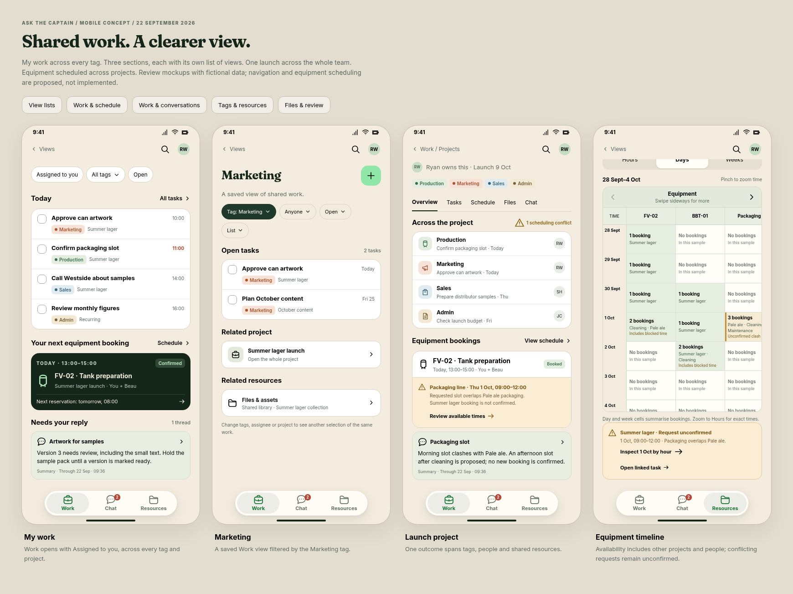

# Captain mobile workspace mockups

**Review concept, 22 September 2026.** Four proposed screens for the Captain/Pip split.
All names, assignments, dates, quantities and conversations shown here are illustrative.
These are documentation artifacts, not implemented application routes or adopted navigation.

[View map: navigation and shared records](views.md) explains how the screens and proposed
destinations fit together, with editable Mermaid sources and SVG/PNG diagrams.


| Screen | Preview | What to review |
|---|---|---|
| A person's working day | [My work](day.png) | Assignments across all four areas, the next equipment booking and a message linked to a task. |
| A business area | [Marketing](marketing.png) | Campaign work across projects, and access to a shared asset library with explicit versions and review states. |
| A project spanning the business | [Summer lager launch](project.png) | Production, Marketing, Sales and Admin together; a confirmed equipment booking, an unconfirmed conflicting request, and a linked discussion. |
| Equipment across projects | [Timeline](timeline.png) | A day with equipment columns and an hourly time axis; confirmed reservations, cleaning, maintenance and an open slot, with a conflicting request kept unconfirmed. |

The same screens after scrolling show the linked conversations and complete asset details:



The equipment timeline is also available as a larger individual preview:


## Navigation being proposed

The same four mobile destinations stay in place: **Home, Work, Chat, Browse**.
Home shows the person's working day; Work contains tasks and projects with list, board,
calendar and timeline views; Chat gathers conversations; Browse exposes the business areas
and shared resources. Marketing is reached through Browse; a launch belongs under Work.
Settings is reached from the account surface in the eventual design.

Area, project and person are different ways to select shared records. Projects span areas;
people work across areas. Opening a project shows the whole project, with area filtering an
explicit choice. Equipment scheduling is a required shared capability, available through
Production, a project's schedule and the person's relevant bookings.

The four layouts use Captain's existing forest/paper/mint palette and Fraunces/Inter type
from `packages/ui/design`. The app header omits the logo and wordmark: a breadcrumb or date
occupies that space, with search and the account avatar alongside it. Screen headings are
26px (25px for the project at narrow widths), and the project title no longer has a forced
line break. Small navigation icons and illustrative asset thumbnails
are authored in this prototype. No Embrace or BrewPlan code, designs or artwork is imported.
The supplied BrewPlan mockups informed the discussion about project context and equipment
timelines; these screens explore Captain's own navigation and visual system.

## Review the editable source

[index.html](index.html) contains the editable layouts, styles and light navigation.
Serve the repository root, then open:

```text
/docs/proposals/assets/captain-mobile-2026-09-22/index.html
/docs/proposals/assets/captain-mobile-2026-09-22/index.html?screen=day
/docs/proposals/assets/captain-mobile-2026-09-22/index.html?screen=marketing
/docs/proposals/assets/captain-mobile-2026-09-22/index.html?screen=project
/docs/proposals/assets/captain-mobile-2026-09-22/index.html?screen=timeline
```

For example, run `python3 -m http.server 8769 --bind 127.0.0.1` from the repository root.
The PNGs need no server. The HTML uses repository-relative design tokens and the existing
Google Fonts stylesheet; system serif/sans fallbacks apply when fonts cannot be fetched.

Browse → Marketing → Summer lager launch demonstrates movement between views. Home returns
to My work. Project Schedule scrolls to bookings; View schedule and Review available times
open the equipment timeline. The timeline links back to the launch project. Chat, asset and slot controls open
explanatory preview sheets; they do not create records or demonstrate working integrations.
Launch task rows illustrate navigation to their project rather than a fourth task-detail screen;
other work opens a note explaining its separate context.
The content scrolls independently above the persistent bottom navigation.

The equipment preview distinguishes a confirmed tank reservation from a conflicting packaging
request. “Review available times” opens the 1 October timeline: confirmed Pale ale packaging
occupies 09:00–12:00, cleaning blocks 12:00–13:00, the illustrative open slot is 13:00–16:00,
and maintenance blocks 16:00–17:00. Viewing that slot does not confirm or move a reservation.
The hour scale is consistent across equipment columns. Project colours identify reservations;
hatched blocks identify unavailable time, with text labels so colour is not the only cue.
The example shows three resources; switching dates, day/week scale, filters and additional
resources still need design and implementation. Production process tracking, recipe models and stock deductions are not
implied by an equipment reservation.

Asset thumbnails are neutral illustrative artwork. Version review, project/task backlinks and
shared-library access are proposed; provider storage, preview and version preservation still
follow the separate files proposal. Chat links should reference one discussion, with access
checks in both directions, rather than duplicate message contents into each view.

## Validation

- Rendered in the shared Chromium browser using Playwright at 360, 390 and 430 CSS pixels wide.
- Checked all four screens for horizontal overflow, vertical scroll access and persistent navigation.
- Checked that the branding is removed and screen headings use the compact type size.
- Exercised Browse → Marketing → project → timeline → project, available-slot details, linked discussion and dismissal.
- Checked JavaScript errors and visually inspected the captured previews.
- PNG screen captures are 390 × 874; the overview shows the four at the same scale.

This is a visual proposal with illustrative populated/conflict states. Complete empty, loading,
failed, disabled and permission states must be designed before application implementation.
No application typecheck, Postgres tests or production-route checks are claimed for these docs.
