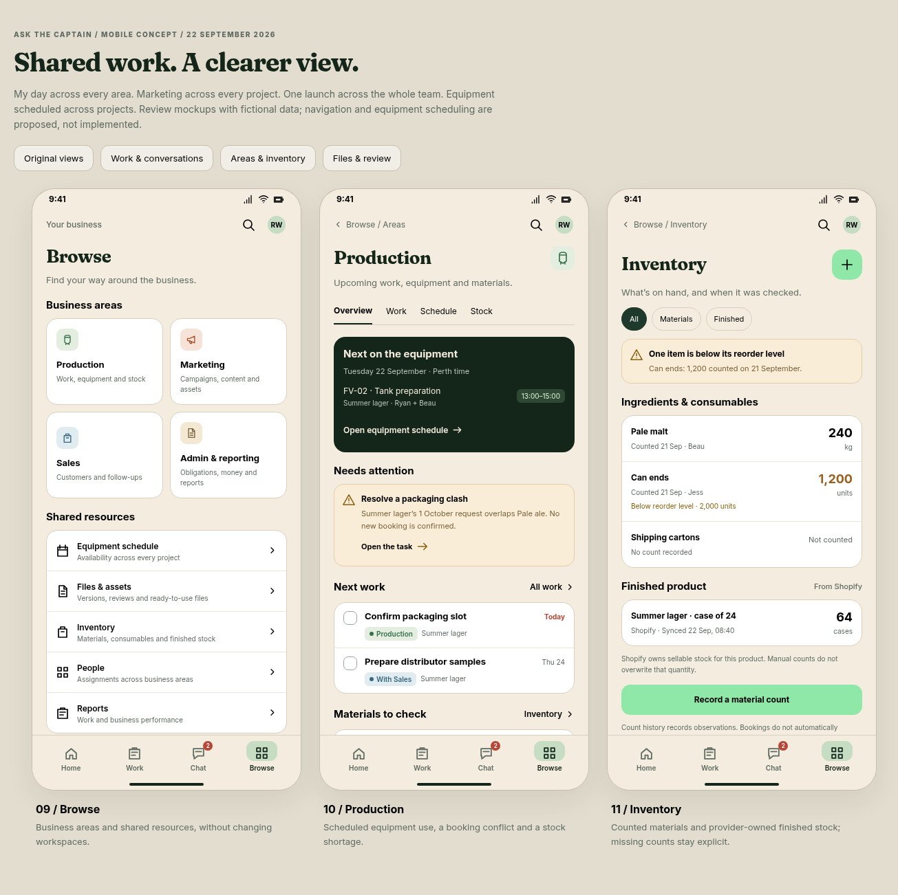
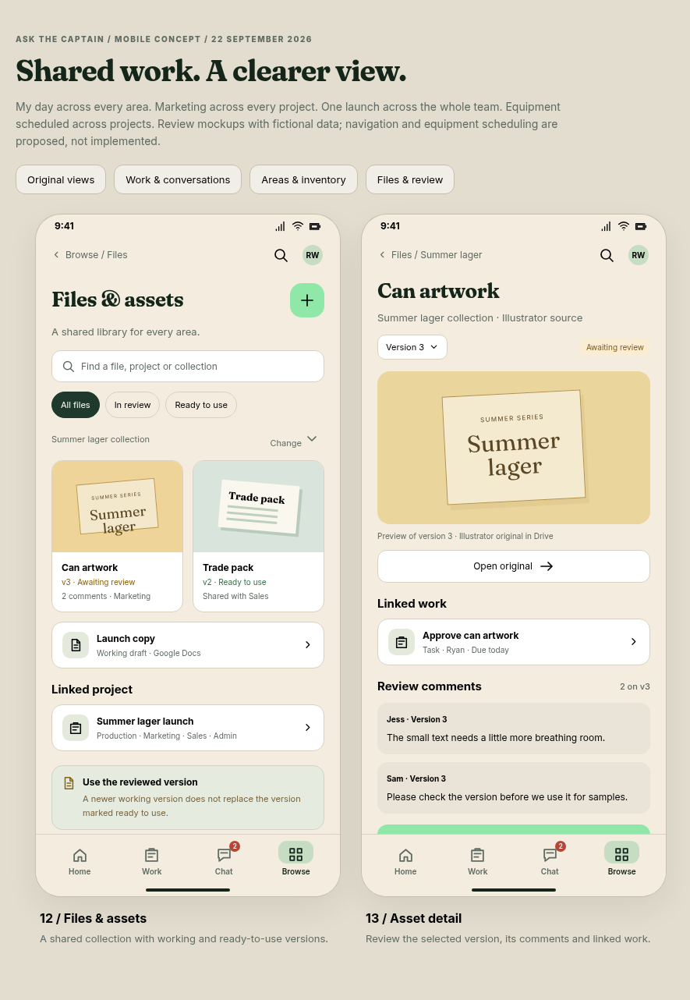

# Captain mobile workspace mockups

**Review concept, updated 23 September 2026.** Thirteen proposed screens for the Captain/Pip split.
The fictional reference day remains 22 September so assignments and conversations stay consistent.
All names, assignments, dates, quantities and conversations shown here are illustrative.
These are documentation artifacts, not implemented application routes or adopted navigation.

[View map: navigation and shared records](views.md) explains how the screens and proposed
destinations fit together, with editable Mermaid sources and SVG/PNG diagrams.


| Screen | Preview | What to review |
|---|---|---|
| A person's working day | [My work](day.png) | Assignments across all four areas, the next equipment booking and a message linked to a task. |
| A business area | [Marketing](marketing.png) | Campaign work across projects, and access to a shared asset library with explicit versions and review states. |
| A project spanning the business | [Summer lager launch](project.png) | Production, Marketing, Sales and Admin together; a confirmed equipment booking, an unconfirmed conflicting request, and a linked discussion. |
| Equipment across projects | [Timeline](timeline.png) | A day with equipment columns and an hourly time axis; confirmed reservations, cleaning, maintenance and an open slot, with a conflicting request kept unconfirmed. |

## New screens: work and conversations


| Screen | Preview | What to review |
|---|---|---|
| Work | [Task list](work.png) | Tasks across areas, projects and recurring duties; shared list with proposed filters/view controls. |
| Task detail | [Packaging task](task.png) · [Artwork variant](task-artwork.png) | Ownership, checklist, supporting record and linked conversation; completing a task does not implicitly confirm a booking or approve a file. |
| Chat | [Conversation list](chat.png) | Work discussions and team conversations, with their task links visible. |
| Conversation | [Packaging discussion](conversation.png) | The same discussion reached from Chat, task or project, with a backlink to work and the equipment schedule. |

## New screens: areas and inventory



| Screen | Preview | What to review |
|---|---|---|
| Browse | [Areas and shared resources](browse.png) | One home for the four business areas and shared resources; no workspace switching. |
| Production | [Production overview](production.png) | Scheduled equipment, a reservation conflict, related work and a counted-stock shortage. No live telemetry is implied. |
| Inventory | [Counted stock](inventory.png) | Ingredient/consumable observations, missing counts, reorder threshold and separately sourced Shopify sellable stock. No ledger or unit aggregation. |

## New screens: files and review



| Screen | Preview | What to review |
|---|---|---|
| Files & assets | [Shared collection](files.png) | Working and ready-to-use files linked to the same launch, available across areas. |
| Asset detail | [Can artwork v3](asset.png) · [Trade pack v2](asset-trade.png) | Version-specific preview, review comments and linked task/project; original stays with its provider. |

The original four screens have also been recaptured with the connected navigation.
[Scroll continuation of those screens](overview-scrolled.png) shows their lower content.

## Navigation being proposed

The same four mobile destinations stay in place: **Home, Work, Chat, Browse**.
Home shows the person's working day; Work contains tasks and projects with list, board,
calendar and timeline views; Chat gathers conversations; Browse exposes the business areas
and shared resources. Marketing is reached through Browse; a launch belongs under Work.
Settings is reached from the account surface in the eventual design.

Area, project and person are different ways to select shared records. Projects span areas;
people work across areas. Opening a project shows the whole project, with area filtering an
explicit choice. Equipment scheduling is a required shared capability, available through
Production, a project's schedule and the person's relevant bookings.

All layouts use Captain's existing forest/paper/mint palette and Fraunces/Inter type
from `packages/ui/design`. The app header omits the logo and wordmark: a breadcrumb or date
occupies that space, with search and the account avatar alongside it. Screen headings are
26px (25px for the project at narrow widths), and the project title no longer has a forced
line break. Small navigation icons and illustrative asset thumbnails
are authored in this prototype. No Embrace or BrewPlan code, designs or artwork is imported.
The supplied BrewPlan mockups informed the discussion about project context and equipment
timelines; these screens explore Captain's own navigation and visual system.

## Review the editable source

[index.html](index.html) contains the original layouts and shared shell.
[additional-views.js](additional-views.js) and [additional-views.css](additional-views.css) contain
the new screens and styles. All data is local illustrative content.
Serve the repository root, then open:

```text
/docs/proposals/assets/captain-mobile-2026-09-22/index.html
/docs/proposals/assets/captain-mobile-2026-09-22/index.html?screen=day
/docs/proposals/assets/captain-mobile-2026-09-22/index.html?screen=marketing
/docs/proposals/assets/captain-mobile-2026-09-22/index.html?screen=project
/docs/proposals/assets/captain-mobile-2026-09-22/index.html?screen=timeline
/docs/proposals/assets/captain-mobile-2026-09-22/index.html?group=work
/docs/proposals/assets/captain-mobile-2026-09-22/index.html?group=areas
/docs/proposals/assets/captain-mobile-2026-09-22/index.html?group=files
```

For example, run `python3 -m http.server 8769 --bind 127.0.0.1` from the repository root.
The PNGs need no server. The HTML uses repository-relative design tokens and the existing
Google Fonts stylesheet; system serif/sans fallbacks apply when fonts cannot be fetched.

The gallery links switch between the original set, Work & conversations, Areas & inventory,
and Files & review. A single-screen URL uses `?screen=` with `day`, `marketing`, `project`,
`timeline`, `work`, `task`, `chat`, `conversation`, `browse`, `production`, `inventory`, `files`
or `asset`. Variant URLs use `?screen=task&item=artwork`, `?screen=asset&item=trade`, or
`?screen=conversation&thread=artwork`.

Connected review paths:

- Home → Work → Confirm packaging slot → Packaging slot discussion → linked task → equipment timeline.
- Browse → Production → Inventory → item count/source explanation.
- Marketing → Can artwork v3 → Approve can artwork → Artwork discussion → Can artwork v3.
- Browse → Files & assets → Trade pack v2; the selected version remains explicitly ready to use.
- Chat → Packaging discussion → linked task; project Chat opens that same discussion.

Top-level Home/Work/Chat/Browse now open their actual mockup screens. Existing task rows,
project work areas and asset links route to the matching detail or an explicit scope note.
Only the packaging and artwork tasks have detail variants; other tasks are illustrative rows.
Project-list selection is a sheet, not a full project-list screen. Filters, dates, view switches,
counts, review actions and message composition explain the intended action without saving
anything, contacting providers, posting messages or pretending an unavailable screen exists.
The content scrolls independently above the persistent bottom navigation.

The equipment preview distinguishes a confirmed tank reservation from a conflicting packaging
request. “Review available times” opens the 1 October timeline: confirmed Pale ale packaging
occupies 09:00–12:00, cleaning blocks 12:00–13:00, the illustrative open slot is 13:00–16:00,
and maintenance blocks 16:00–17:00. Viewing that slot does not confirm or move a reservation.
The hour scale is consistent across equipment columns. Project colours identify reservations;
hatched blocks identify unavailable time, with text labels so colour is not the only cue.
The example shows three resources; switching dates, day/week scale, filters and additional
resources still need design and implementation. Production process tracking, recipe models and stock deductions are not
implied by an equipment reservation.

Asset thumbnails are neutral illustrative artwork. Version review, project/task backlinks and
shared-library access are proposed; provider storage, preview and version preservation still
follow the separate files proposal. Chat links should reference one discussion, with access
checks in both directions, rather than duplicate message contents into each view.

## Validation

- Rendered in the shared Chromium browser using Playwright at 360, 390 and 430 CSS pixels wide.
- Checked all thirteen screens for horizontal overflow, vertical scroll access and persistent navigation.
- Checked that the branding is removed and screen headings use the compact type size.
- Exercised task ↔ conversation, task → equipment, area → inventory, asset ↔ task ↔ conversation, ready-version selection, missing-count/provider-stock explanations and dismissal.
- Checked JavaScript errors and visually inspected the captured previews.
- PNG screen captures are 390 × 874; each gallery shows its screens at the same scale. Artwork-task and trade-pack variants are captured separately.

This is a visual proposal with illustrative populated/conflict states. Complete empty, loading,
failed, disabled and permission states must be designed before application implementation.
No application typecheck, Postgres tests or production-route checks are claimed for these docs.

Remaining full-screen designs include Sales, Admin/reporting, People, Reports, Search, Settings,
the project list, Board and work Calendar. Their existing entry points remain labelled preview
placeholders; this set does not imply those screens or any runtime capability have shipped.
