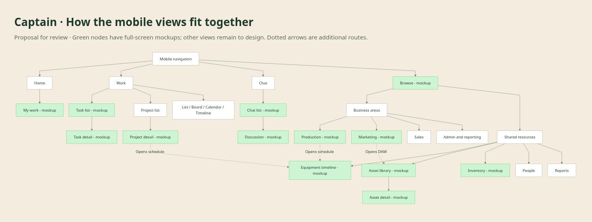
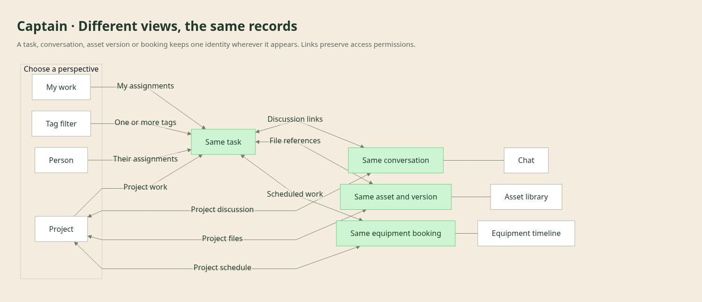

# How Captain's mobile views fit together

**Proposed navigation, updated 23 September 2026.** Advances **own commitments** and **brief and answer**.
This maps the Captain/Pip discussion and the thirteen mobile mockups. It is not the live app's
navigation or an adopted replacement for D11.

## Where views live

[Zoomable SVG](navigation.svg) · [Editable Mermaid source](navigation.mmd) · [Screen mockups](README.md)

Green nodes, also labelled **mockup**, are the screens already drawn. The other nodes
describe proposed destinations or view choices, not implemented or fully designed screens.
Solid arrows show the main navigation hierarchy; dotted arrows show additional routes into
the same destination. They do not create additional copies of the data. The map omits ordinary
back navigation to keep the hierarchy readable.

| Destination | Contents and scope |
|---|---|
| Home → My work | The person's assignments across areas/projects, relevant equipment bookings and conversations needing a reply. Open those items in their task, project, schedule or conversation context. |
| Work | Task and project lists. List, Board, Calendar and Timeline are presentations, with area/project/person filters where relevant. A work timeline and an equipment timeline have different lanes, while linking the same scheduled work. |
| Project detail | Overview, Tasks, Schedule, Files and Chat. These are views within one project; the project can span every area. The Schedule summary opens the shared equipment timeline to inspect availability/conflicts across projects. |
| Task detail | Owner, area, optional project, dates/status, supporting files, linked discussion and relevant equipment reservations. Packaging and artwork task variants are mocked up. Standalone and recurring tasks do not require a project. |
| Chat | Conversation list and discussion detail mockups cover team conversations and discussions about work. Project/task discussion links open the same conversation from either side. The activity log remains separate. |
| Browse → Areas | Production, Marketing, Sales and Admin/reporting. Each gathers relevant work across projects. People can work in several areas; area selection is not a workspace or permission change. |
| Marketing | Overview, Work, Assets and Calendar. Assets opens the shared DAM; a campaign/project link opens the whole project, including the work outside Marketing. |
| Production | Relevant work and equipment scheduling, with access to stock information. The area overview and equipment timeline are both mocked up. |
| Sales; Admin/reporting | Sales work/customer follow-ups; recurring obligations and reporting/Xero-linked evidence. Their detailed area views remain to design. Xero remains accounting authority. |
| Browse → Shared resources | Equipment schedule, Asset library, Inventory, People and Reports. These remain available across areas; area-specific shortcuts open these same resources. |
| People | Find a person and their assigned work across areas/projects. Their work uses the same task records seen under Work and in projects. Detailed people/availability views remain to design. |
| Inventory | Ingredients, consumables and finished product in a simple counted list, with explicit provider authority where applicable. Equipment reservations do not deduct stock automatically. |
| Asset library | Collections, file/version detail, previews, review notes and links to work. Marketing is a natural entry point; the library is shared across the business. |
| Equipment timeline | Reservations across projects, with cleaning/maintenance and availability. A reservation links to the work and responsible people. A conflicting request stays unconfirmed. |
| Reports | Business and area views over available records; reports should link to supporting work and evidence. Report definitions/layouts are still to design. |

**Available from the header:** Search opens accessible records in their existing context;
the account avatar leads to account/settings. Breadcrumbs go back through the current context.
These are global controls, not extra bottom-navigation tabs. Search and settings are not yet
full-screen mockups.

## How views connect without copying records

[Zoomable SVG](relationships.svg) · [Editable Mermaid source](relationships.mmd)

The second panel maps record identity and navigation between contexts, not database tables or
required relationships. A task need not have a project, file, booking or discussion. Bidirectional
links mean a person can navigate both ways where they have access; a link does not grant access
to a private conversation or source file.

For example, **Confirm packaging slot** can appear in Ryan's My work, Production, Work and the
Summer lager project. Opening its discussion from Chat or the project reaches the same thread.
The conflicting request appears in the project and equipment schedule; resolving it changes
one reservation. The task remains the same task throughout.

**Validation:** both Mermaid sources parsed and rendered in Chromium with Mermaid 11.12.0;
SVG and PNG exports were visually inspected. Mermaid was loaded only for rendering, with no
repository dependency added. The browser-rendered SVG/PNG files are review exports; the `.mmd`
files are editable sources. No application routes or runtime behaviour changed.
