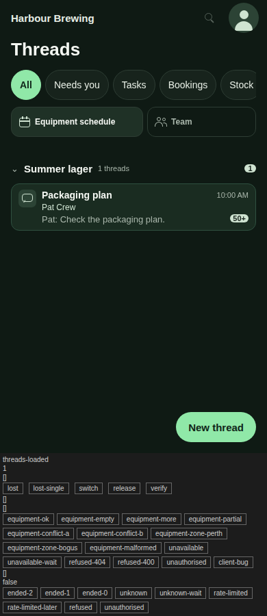
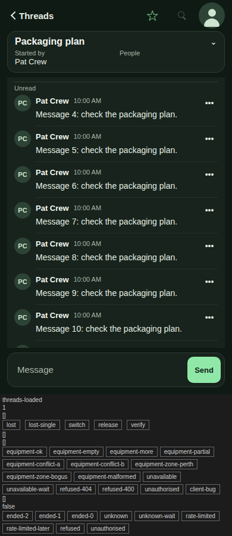
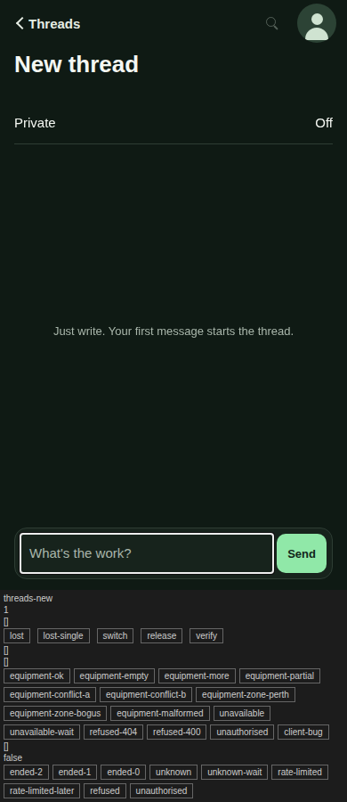
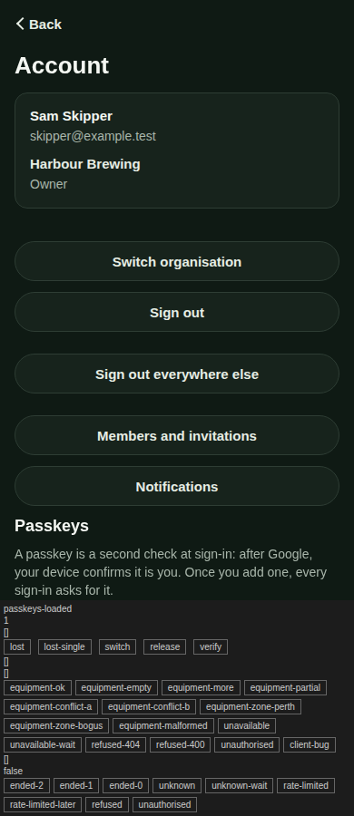
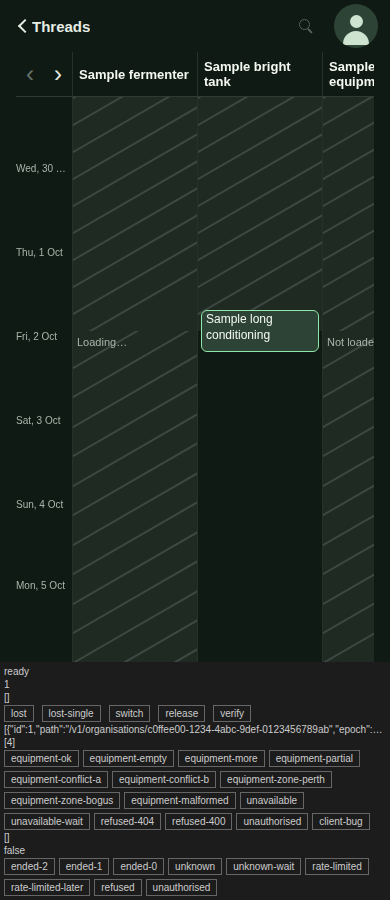

# Dark colour scheme — validation record (2026-10-02)

Workspace outcome: manage shared work / discuss work — the client follows the device's colour scheme. Presentation
only: no behaviour, route, storage or API change.

## What changed

- `apps/mobile/src/theme/tokens.ts` exports `light` and `dark` palettes of one type-checked `Palette` and
  `paletteFor(scheme)`. The static `colors` export is removed, so no screen can use a static colour.
- `apps/mobile/src/theme/theme.ts`: `useTheme()` (React Native `useColorScheme`, which follows
  `prefers-color-scheme` on the web) and `themedStyles(build)`, which creates each scheme's StyleSheet once. Every
  screen and component that used `colors` builds its styles through it; icons take their colour from the palette.
- `app.json` `userInterfaceStyle` is `automatic`; the status bar style is `auto`.
- `public/index.html`: `color-scheme: light dark`, one `theme-color` meta per scheme, and an inline page background
  with a dark media query, so the document is the page colour before React paints. `manifest.webmanifest` keeps
  the light colours.
- The test-only harness panel has a neutral dark variant (light unchanged), so dark screenshots have no light band.

## Tokens added beyond the reviewed list

| Token | Light | Dark | Why |
|---|---|---|---|
| `plain` | `#000000` | `#e6ede4` (body) | Text with no designed colour (fold chevron, `•••`, checkbox glyph, plain status lines). Light keeps the platform default black it rendered before; dark would otherwise be black on the dark page. |
| `unknown` | `rgba(84, 101, 90, 0.10)` | `rgba(169, 182, 171, 0.10)` | Equipment timeline "not known" base tint (previously an inline literal). Muted at 10% in each scheme. |
| `unknownStripe` | `rgba(84, 101, 90, 0.22)` | `rgba(169, 182, 171, 0.22)` | Its stripes (previously an inline literal). Muted at 22%. |
| `shadow` | `#142619` | `#000000` | The reservation panel's drop shadow (previously `heading`, which in dark would be a light glow). |

Contrast of the added text token: plain on page 19.04 / 14.94, on card 21.00 / 13.60. Muted text on unknown time:
4.93 / 7.06. The light values are what the screens already painted.

## Contrast (WCAG 2.x, `src/theme/tokens.test.ts`, fails under 4.5:1)

| Pair | Light | Ratio | Dark | Ratio |
|---|---|---|---|---|
| heading on page | `#142619` on `#f1f5ee` | 14.41 | `#f4f7f2` on `#0f1a14` | 16.49 |
| body on page | `#1f3a2c` on `#f1f5ee` | 11.20 | `#e6ede4` on `#0f1a14` | 14.94 |
| muted on page | `#54655a` on `#f1f5ee` | 5.62 | `#a9b6ab` on `#0f1a14` | 8.46 |
| plain on page | `#000000` on `#f1f5ee` | 19.04 | `#e6ede4` on `#0f1a14` | 14.94 |
| action on page | `#276744` on `#f1f5ee` | 6.12 | `#90e8a8` on `#0f1a14` | 12.13 |
| heading on card | `#142619` on `#ffffff` | 15.90 | `#f4f7f2` on `#17231c` | 15.02 |
| body on card | `#1f3a2c` on `#ffffff` | 12.35 | `#e6ede4` on `#17231c` | 13.60 |
| muted on card | `#54655a` on `#ffffff` | 6.20 | `#a9b6ab` on `#17231c` | 7.70 |
| plain on card | `#000000` on `#ffffff` | 21.00 | `#e6ede4` on `#17231c` | 13.60 |
| action on card | `#276744` on `#ffffff` | 6.75 | `#90e8a8` on `#17231c` | 11.05 |
| sageText on card | `#2d4c36` on `#ffffff` | 9.55 | `#cfe3d1` on `#17231c` | 12.03 |
| actionText on action | `#ffffff` on `#276744` | 6.75 | `#10261a` on `#90e8a8` | 10.88 |
| sageText on sage | `#2d4c36` on `#dbe6d4` | 7.41 | `#cfe3d1` on `#2c4335` | 7.93 |
| heading on sage | `#142619` on `#dbe6d4` | 12.32 | `#f4f7f2` on `#2c4335` | 9.91 |
| muted on sage | `#54655a` on `#dbe6d4` | 4.81 | `#a9b6ab` on `#2c4335` | 5.08 |
| heading on needsYou | `#142619` on `#e9f2e4` | 13.84 | `#f4f7f2` on `#1a2c21` | 13.63 |
| body on needsYou | `#1f3a2c` on `#e9f2e4` | 10.76 | `#e6ede4` on `#1a2c21` | 12.34 |
| muted on needsYou | `#54655a` on `#e9f2e4` | 5.40 | `#a9b6ab` on `#1a2c21` | 6.99 |
| sageText on needsYou | `#2d4c36` on `#e9f2e4` | 8.32 | `#cfe3d1` on `#1a2c21` | 10.91 |
| heading on pinned | `#142619` on `#e3ebdd` | 13.02 | `#f4f7f2` on `#1f3126` | 12.74 |
| body on pinned | `#1f3a2c` on `#e3ebdd` | 10.11 | `#e6ede4` on `#1f3126` | 11.54 |
| card on sageText (pip) | `#ffffff` on `#2d4c36` | 9.55 | `#17231c` on `#cfe3d1` | 12.03 |
| muted on unknown time | `#54655a` on `#e1e7df` | 4.93 | `#a9b6ab` on `#1e2a23` | 7.06 |

Every pair passes in both palettes; no owner value needed a change. The lowest is muted on sage (the current
organisation's role line): 4.81 light, 5.08 dark. Disabled controls are drawn at reduced opacity and are exempt
under WCAG 1.4.3; they are not in the table.

Equipment timeline, non-text: unknown time composited over the page is 1.14:1 against free time in light and
1.20:1 in dark; with its stripes 1.52:1 light and 1.89:1 dark. The test requires dark to be at least as distinct as
the reviewed light scheme. Where a 2 px stripe crosses the state's words, muted on the stripe is 3.70:1 light
(unchanged from before) and 4.47:1 dark.

## Browser checks

`apps/e2e/scripts/mobile-shell-dark-check.cjs` (run from `mobile-shell-check.cjs` at 390 px) opens the harness
scenarios `threads-loaded` (thread list and a thread), `threads-new`, `passkeys-loaded` (settings) and `ready` (the
equipment schedule, answered `equipment-ok` three times) with Playwright `colorScheme: 'dark'`, then again with
`'light'`. For each scheme it asserts the document and body background before React paints, the two `theme-color`
metas, the page colour behind each heading or card, a card surface on each screen, the heading text colour, the
unknown tint on the timeline and the page colour of read time, no horizontal overflow and no page errors.

A separate pixel comparison (not checked in) rendered the same harness routes plus members, organisation and
notifications at 390 px in the light scheme from a `main` export and from this branch: all seven screens were
pixel-identical (0 differing pixels).

## Screenshots (dark, 390 px, synthetic harness data)

| Thread list | Thread | New thread |
|---|---|---|
|  |  |  |

| Settings | Equipment schedule |
|---|---|
|  |  |

The grey band at the bottom is the test-only harness panel, which is never in a production export.

## Compared with the reference frames (t-e-reference-15, -16)

Surfaces, text, chips, pinned rows, needs-you rows and the composer match the reference palette. Differences that
remain are layout or content, not colour, and predate this change: the reference avatar shows initials where the
shell shows a figure; the reference pip is the action mint, the shell's pip is `sageText` with card text (as in
light); the reference's agent messages, approval buttons and undo card are not built; the reference's thread
list rows show more facts. The equipment schedule has no reference frame in dark.

## Not covered

- Native devices: no iOS or Android build or simulator ran. iOS honours `userInterfaceStyle: automatic` directly;
  on Android Expo documents that it needs `expo-system-ui`, which the plan does not name and this change does not
  add. The native splash and the Android adaptive icon background stay the light page colour (a dark splash needs
  the `expo-splash-screen` plugin, also not added), so a native dark launch shows the light splash briefly.
- Assistive technology and forced-colours / high-contrast modes.
- Hosted staging: nothing was deployed.
- Placeholder colours of the members and passkey-name inputs are the browser default (unchanged from before).
