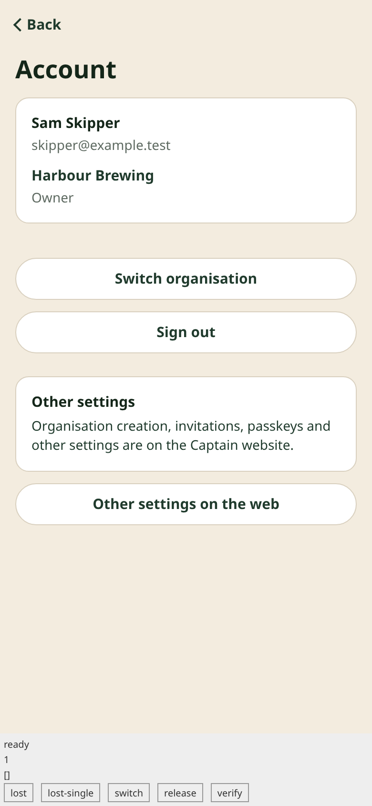
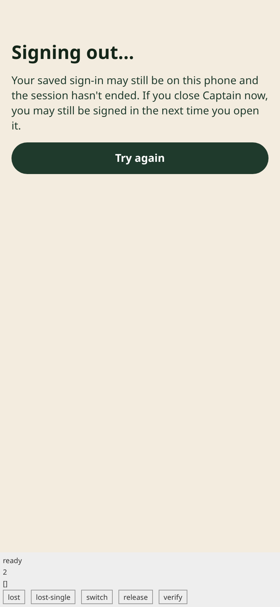

# Mobile account composition — 27 September 2026

Implementation: the reviewed composition contract in #195. This increment connects the existing
native authentication core and installed-platform adapters to the account provider, welcome,
organisation chooser and Account screens. Work, Chat and Resources remain navigation shells with
honest notices; they do not fetch business records yet.

Validation before integration:

- Mobile typecheck and client source boundary pass.
- 165 pure account/auth/protocol tests and 20 boundary-guard tests pass with no skips.
- Ten workspace typechecks pass (eight unchanged package checks reused from the cache).
- Installed Expo SDK dependencies pass compatibility check.
- Generated Android configuration retains SecureStore exclusions for backup and device transfer.
- Production web, iOS and Android JavaScript exports, and the separate synthetic account web
  harness export pass. All four pass the secret-name/canary scan. Harness marker and router paths
  are absent from all three production exports and present in the harness export.
- Chromium browser checks pass at 360, 390 and 430 px: account states and commands, production
  web-only entry/deep links, guarded history after access loss/sign-out, fresh tabs on organisation
  change, one-use destinations, disabled retries until the exact deadline, stable subscriptions,
  fixed website destinations, and no outside-origin requests, page errors or console errors.

Peer review found and corrected unstable account snapshots, unexpected composition errors,
organisation-change navigation that retained nested tab state, and a one-use destination flag
that did not survive a root-layout remount. Browser validation also exposed a test-source lifetime
mismatch: the synthetic account must survive layout remounts like the production account instance.
The browser checks now isolate history scenarios and assert that navigation preserves the same
JavaScript document, drops old tab mounts, and shows the new organisation.

The harness injects account snapshots and records commands; it does not authenticate against an
API. Node tests use injected storage, transport and platform adapters. Neither proves SecureStore,
claimed HTTPS links, native browser handoff, iOS/Android rendering, gestures or device behaviour.
No signed build, simulator or physical-device run was performed. No database/backend behaviour
changes in this increment; Postgres regression is left to the normal workspace CI job.

Native sign-in remains disabled on shared staging and for real accounts. No staging deployment,
migration, data reset, additional machine, secret, DNS or production change accompanies this code.
The existing Next.js web product remains the usable client.

Final local run: `mobile-composition-check-r4.log`, `mobile-composition-tests-r4.log`,
`mobile-composition-exports.log` and `mobile-composition-browser-r4.log` in the coordinator
workspace. CI independently repeats the checks on the PR commit. The two screenshots below are
synthetic browser evidence, including the visible test-only control strip.

