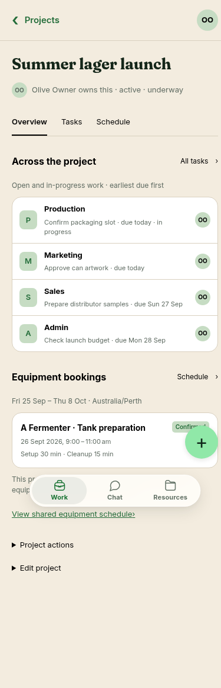
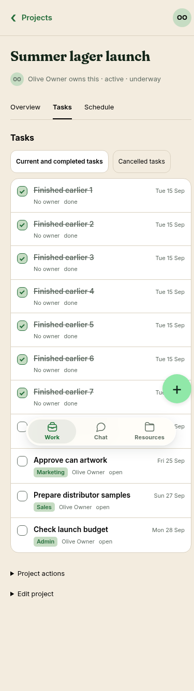
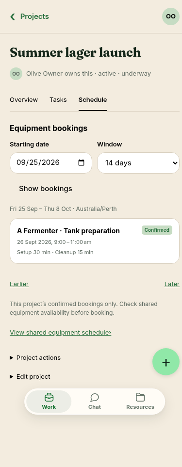

# Project overview and schedule — 25 September 2026

Outcomes: **manage shared work** and **allocate resources**. The approved
[project mockup](../../proposals/assets/captain-mobile-2026-09-22/project.png) remains the design
source; these screenshots record the bounded implementation. They use fictional records created
through the real API in a disposable local Postgres and a production Next.js build, not staging data.

The compact owner/state header and Overview/Tasks/Schedule navigation follow the reference.
Overview shows the earliest six open/in-progress tasks across shared tags and the first three
confirmed bookings in the next fourteen calendar days, with explicit continuation links. Tasks
keeps completion/reopen and cancelled history. Schedule has an explicit business-timezone date
window, pagination, and links to booking details and shared equipment availability.

Intentional limits: tags use neutral shared styling because the data has no tag-colour/icon contract;
no whole-project tag/count claim is derived from a page. Dates come from the business timezone.
There is no invented launch date, progress percentage, scheduling conflict or unconfirmed request.
Chat and Files need their own real records/contracts. The project schedule is a booking list;
the shared equipment timeline remains the place to see other projects' occupancy.

`apps/e2e/scripts/project-overview-check.cjs` captures all three populated views at 360, 390, 430 and
1440 pixels and checks the single heading, no horizontal overflow, completed-history exclusion,
in-progress work, keyboard completion, parent navigation, reservation links, 52-booking pagination,
window changes, independent read failures, empty projects and archived history. Its bulk fixture
setup is followed by a full request-budget window before fault injection; production limits stay
unchanged. The existing Work-record suite retains edit/archive/restore and equipment-link checks.

Claude implemented and root reviewed the API/SQL/tests; Claude reciprocally reviewed the UI.
The review corrected historical completed tasks crowding the preview, former-member wording and
schedule recovery links. Browser inspection corrected the schedule selector's label and plus styling.
Booking times retain explicit offsets across a clock change. This is not full native-device,
screen-reader, Files/Chat or overall mockup acceptance. Remaining design work stays in #142.
