# T-E — thread presentation, revised 1 October 2026

Workspace outcome: discuss work. Presentation-only changes from main `49163c2` after
#230 and #232, amended on the same branch after review of #233 (`71a5d0f`).
Authority: D14, the [reviewed prototype](../../proposals/assets/captain-chat-first-2026-09-30/README.md),
frames 1–3 and 15–16, and the owner's second design-pass brief. **The prototype
frame wins where the first brief disagreed.** This replaces the first pass's shared
white group cards and top-positioned new-thread composer.
No controller, parser, request, storage, route, permission or database changes.

## Review of all ten requested items

| Item | Result |
|---|---|
| 1. Individual rows | Separate rounded cards, sage fill plus count pip for needs-you rows, white otherwise. Each has a left icon tile for task, booking, stock, topic or private and the existing three text lines. |
| 2. Filter row | One horizontally scrolling row; action-green selected chip with white text, no invented counts. Permanent Files/People hint removed. **Exception:** Files and People remain disabled by the existing controller; their selected state cannot be reached without a behavior change. The conditional hint is present for that state, and the disabled chips retain their names plus an unavailable accessibility hint. No new selection behavior or API calls were added. |
| 3. Pinned views | Two compact buttons side by side. Equipment gets slightly more width to keep its full label at 360px; Team retains its unavailable appearance and semantics. Existing accessible labels include their descriptions. |
| 4. Group heading | One line: chevron, label, muted owner/dates/thread-count metadata (ellipsized), and a right-hand needs-you pip only when positive. |
| 5. Fact labels | Owner/Due, Equipment/Start, Count/Counted, or Started by/People from the known record kind; the existing values remain unchanged. |
| 6. Messages | Round initials avatars; a neutral dash for a missing author. Author, time and body sit to the right. Centered day dividers use the same device timezone as message times and appear at the first loaded day and each date change. They are separate siblings of measured message rows, so a day label alone is not a visible message. White messages retain inset separators. |
| 7. Earlier messages | Dashed, full-width quiet row above the first loaded message; same label, test ID and pagination action. |
| 8. Send | Action green and white text on both composers, including disabled states; all existing disabled, locked and retry guards/accessible labels remain. |
| 9. New-thread layout | “New thread” heading, focused growing composer fixed at the bottom, and centered “Just write. Your first message starts the thread.” hint. No claim about future classification. |
| 10. Private choices | Toggle, title and people picker remain at the top under the heading, in the scrollable area above the hint. The composer stays fixed while that area scrolls. |

Item 2's unreachable selected Files/People state is the only partial match among
the ten requested items. As before, system typography remains: prototype font files
are not installed as application assets. This is not a pixel-identical font rendering
or a claim that future agent/attachment controls shown in the prototype are available.

## Screenshots beside the reviewed frames

Each image links to its full-size file. The after images are from the revised production
Expo web export, at a 900px viewport height, in isolated Chrome contexts with synthetic
sessions. The second-pass fixtures show all five supported row kinds, two message days,
a missing author and an earlier-message page, so those presentation details are reviewable.
The thread screenshot scrolls to the top of the loaded page to show the earlier row;
normal opening at the first unread message is still checked by the regression suite.

| Screen / reference | After 360px | After 390px | After 430px |
|---|---|---|---|
| [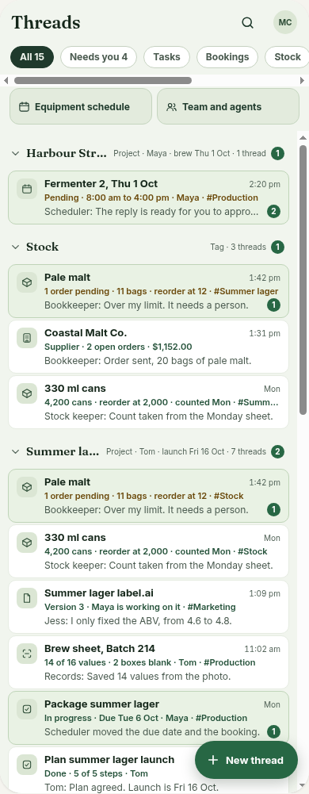](t-e-reference-1.png) | [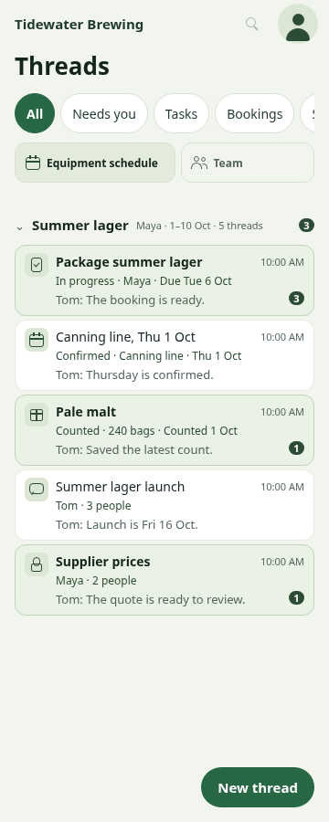](t-e-360-after-list.png) | [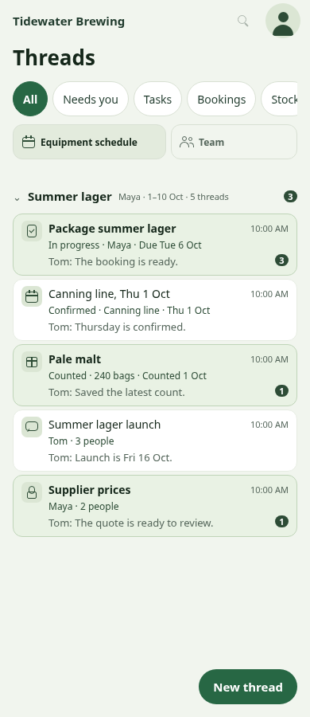](t-e-390-after-list.png) | [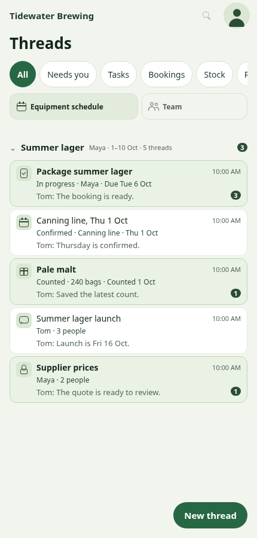](t-e-430-after-list.png) |
| [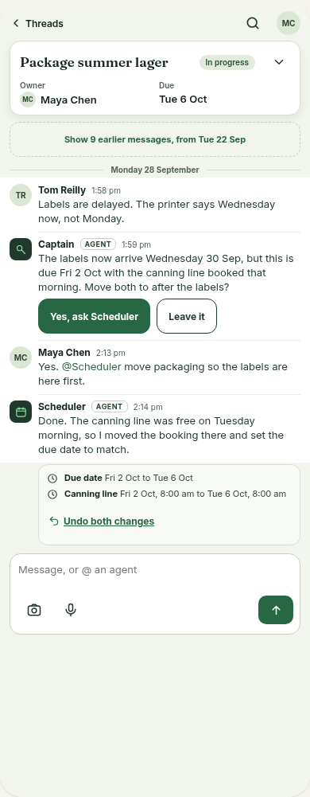](t-e-reference-3.png) | [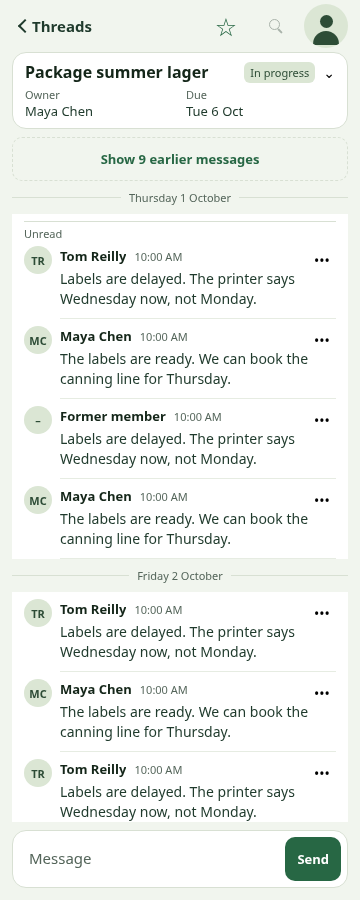](t-e-360-after-thread.png) | [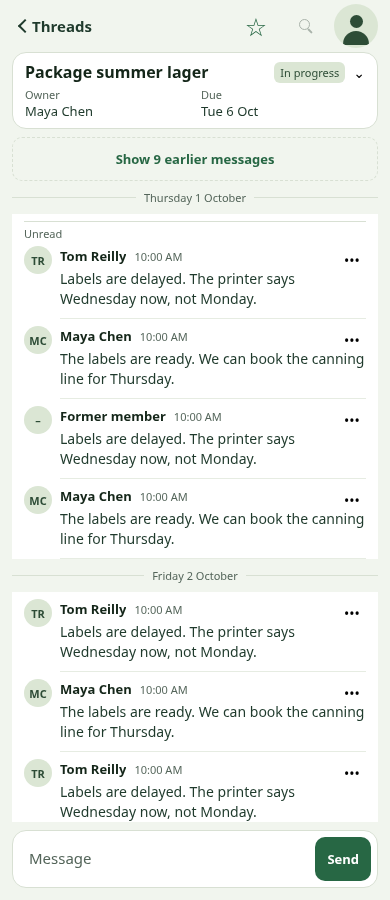](t-e-390-after-thread.png) | [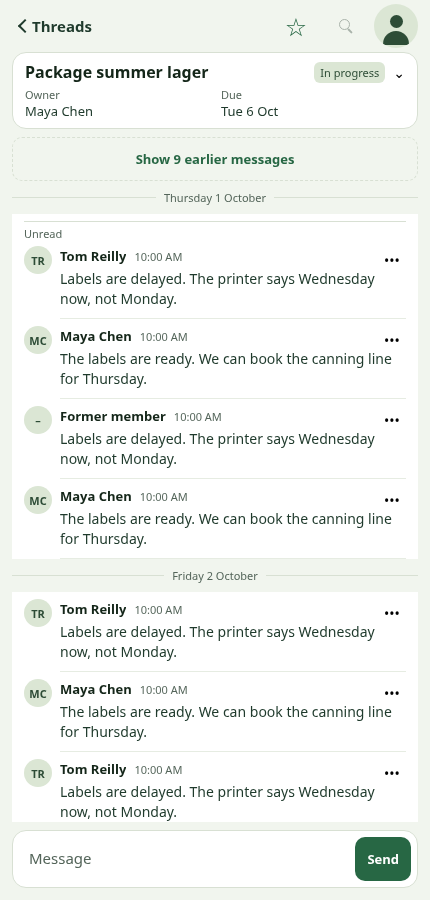](t-e-430-after-thread.png) |
| [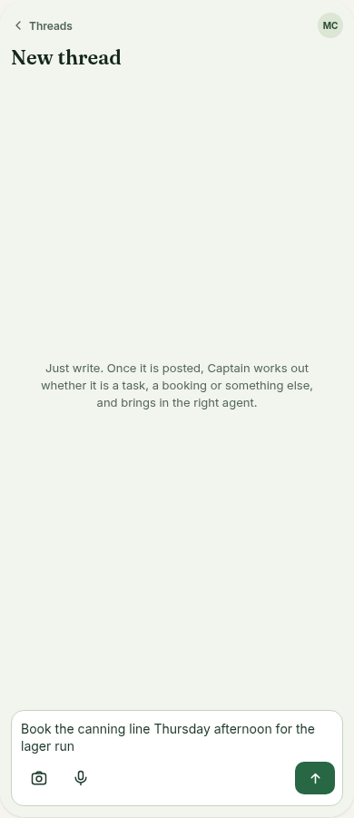](t-e-reference-2.png) | [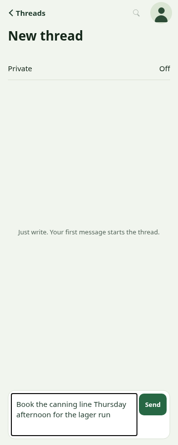](t-e-360-after-new.png) | [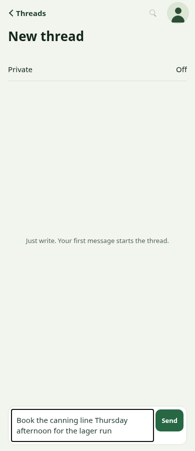](t-e-390-after-new.png) | [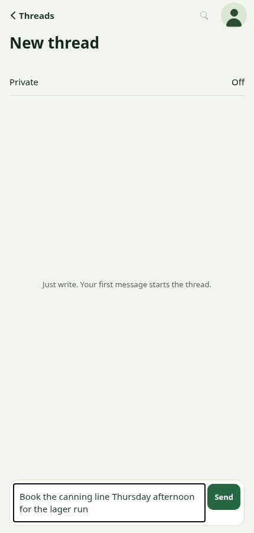](t-e-430-after-new.png) |

Private choices after: [360](t-e-360-after-private.png),
[390](t-e-390-after-private.png), [430](t-e-430-after-private.png).

Original main baseline (before both presentation passes):

| Width | List before | Thread before | New thread before |
|---|---|---|---|
| 360 | [list](t-e-360-before-list.png) | [thread](t-e-360-before-thread.png) | [new](t-e-360-before-new.png) |
| 390 | [list](t-e-390-before-list.png) | [thread](t-e-390-before-thread.png) | [new](t-e-390-before-new.png) |
| 430 | [list](t-e-430-before-list.png) | [thread](t-e-430-before-thread.png) | [new](t-e-430-before-new.png) |

The original baseline has the earlier three-row/single-day fixture. First-pass after
images and evidence remain in commit `71a5d0f`; the after files here supersede them.
Dark references remain [frame 15](t-e-reference-15.png) and [frame 16](t-e-reference-16.png).

## Contrast and dark-scheme deferral

Dark mode is deferred in full under the brief's permitted exception. The app has a
single static palette referenced throughout shared screens/components, with colors baked
into `StyleSheet.create`; it has no reactive theme provider. A reliable native/web
scheme switch requires a separate theme pass, including account and record screens.
This PR neither implements nor claims dark-scheme support.

Measured light-palette contrast uses sRGB relative luminance and
`(lighter + 0.05) / (darker + 0.05)`. Ratios below cover opaque text used by the revised
presentation; decorative dividers deliberately remain faint. Existing inactive
shared shell controls are unchanged; these figures are not an app-wide accessibility audit.

| Foreground | White surface | Page `#f1f5ee` | Sage `#dbe6d4` |
|---|---:|---:|---:|
| Heading `#142619` | 15.90:1 | 14.41:1 | 12.32:1 |
| Body `#1f3a2c` | 12.35:1 | 11.20:1 | 9.58:1 |
| Secondary/placeholder `#54655a` | 6.20:1 | 5.62:1 | 4.81:1 |
| Action/star `#276744` | 6.75:1 | 6.12:1 | 5.24:1 |
| Fact/chip `#2d4c36` | 9.55:1 | 8.66:1 | 7.41:1 |

White Send text on action green is **6.75:1**; white unread-pip text on
`#2d4c36` is **9.55:1**. Send retains action green and white text in every state, **6.75:1**,
without an opacity reduction; disabled semantics and send guards remain intact. Quiet disabled actions use secondary text.

The row tint `#e9f2e4` and pinned-view fill `#e3ebdd` match the light reference frame;
the row tint keeps the sage icon tiles visually distinct. Additional ratios:

| Foreground | Needs-you row | Pinned view |
|---|---:|---:|
| Heading | 13.84:1 | 13.02:1 |
| Body | 10.76:1 | 10.11:1 |
| Secondary | 5.40:1 | 5.08:1 |
| Action | 5.88:1 | 5.53:1 |
| Chip/icon | 8.32:1 | 7.82:1 |

## Validation

All heavy commands ran under `flock /tmp/atc-build.lock`, with serial mobile test workers.

- Mobile TypeScript and source boundary checks: pass.
- Mobile tests: **413 passed**, plus **20** configuration/boundary tests; none skipped.
- SDK dependency check, Android backup configuration introspection, production web,
  iOS and Android exports, separate web harness export, and bundle canary/boundary check: pass.
- Revised presentation checks at **360, 390 and 430px** cover sage/white rounded rows,
  single-row scrolling filters, selected chip color, side-by-side pinned views, group metadata,
  labelled fact columns, avatars including a missing author, two day dividers, dashed earlier row,
  green Send, bottom focused new-thread composer, growing input, Private layout and failure retry.
- Full browser regressions: **360, 390, 430 and 1280px passed**, including thread
  writes/retries, private creation and tags, session/account controls and equipment.
- API typecheck and real-Postgres thread list/thread/session regressions: **49 passed**,
  none skipped.

Logs: [mobile checks/tests](t-e-tests.log), [exports](t-e-exports.log),
[presentation checks](t-e-layout.log), [browser regressions](t-e-browser.log),
[Postgres regressions](t-e-postgres.log).

The final typecheck, exports and presentation captures were repeated after the
reference-color, long-author truncation, new-thread spacing and day-divider markup refinements.
The focused thread regression was also repeated at all three phone widths to recheck
first-unread opening, visible reads, paging and existing writes/retries.

One focused capture logged all assertion passes but then ended with SIGTERM (143);
that process result was not counted. The temporary capture runner was repeated with
explicit shutdown after successful checks. The checked-in CI runner is unchanged.

Not covered: native runtime/keyboard/SecureStore, installed apps, screen-reader or
assistive-device testing, dark mode, hosted API/deployment or real business data.
Exports alone do not establish native runtime behavior. No merge or deployment performed.
