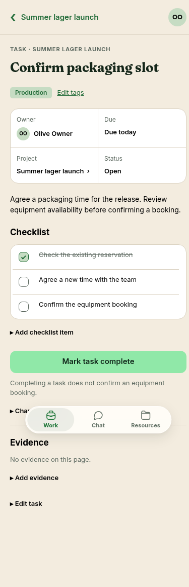
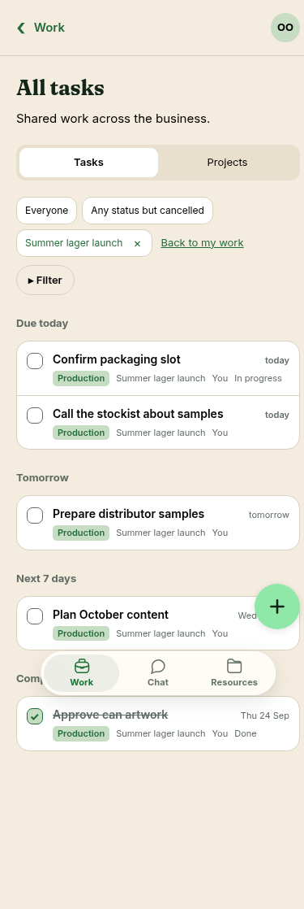

# Task and Work-list design alignment — 25 September 2026

Outcome: **manage shared work**. This records a bounded implementation of the approved
[task](../../proposals/assets/captain-mobile-2026-09-22/task.png),
[artwork task](../../proposals/assets/captain-mobile-2026-09-22/task-artwork.png) and
[all-work](../../proposals/assets/captain-mobile-2026-09-22/all-work.png) references.
The mockups remain the design authority; these screenshots record implementation evidence.

The screenshots use fictional records created through the real API in a disposable local Postgres
fixture and the production Next.js build. They contain no staging/customer data. The business date
comes from the organisation timezone rather than the historical date printed in the mockups.

Implemented in this increment:

- Compact task eyebrow and one heading; owner initials and a two-by-two metadata panel.
- Checklist before a full-width Complete/Reopen action. Additional checklist, evidence and status
  editors are disclosures; actual evidence links remain visible. Empty evidence follows the action.
- Checkable rows in Work, project and recurring-work task lists. The existing API checks revision,
  permissions and evidence; a refused or uncertain save does not fabricate a tick.
- A persistent completion announcement and keyboard focus that survive row removal or regrouping.
- Tasks/Projects navigation, compact filter pills, and due-date groups for the loaded Work page.
  Completed work is not presented as overdue. Missing business dates do not imply relative urgency.

The root agent reviewed Claude's task-detail implementation against the reference images,
removed duplicate heading markup, compacted metadata and reordered empty evidence. Claude reviewed
the root agent's list implementation and confirmed the fixes for pending feedback, required-evidence
navigation, checkbox contrast and keyboard focus. Both inspected code; actual browser evidence
comes from the separate regression run.

Checks use the existing `workspace-fixture.ts`, real Postgres, and `apps/e2e/scripts/`.
Run each suite with a fresh disposable fixture to isolate catalogue mutations and request budgets;
application limits remain enabled. The scripts are:
`workspace-check.cjs`, `optional-projects-check.cjs`, `checklist-navigation-check.cjs`, and
`work-design-check.cjs`. The last script checks populated screens at 360, 390, 430 and 1440 pixels,
primary completion/reopen, list regrouping/filter removal, keyboard confirmation, and refusal of
both completion controls until required evidence is added. Other scripts retain stale/lost-response,
parent-navigation, pagination, tag, project, recurring-work and equipment-link coverage.

Remaining [#142](https://github.com/SomedaySomehowBeer/askthecaptain/issues/142) work includes
project overview/schedule composition and the complete search/filter presentation. Contextual
bookings, chat, summaries and files require real authorised records and appropriate contracts;
these screens do not invent them. This is not full design, native-device or screen-reader acceptance.
